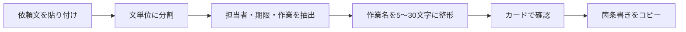
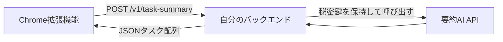

# 仕事ほどき

> **長い依頼文を、次に動ける短いタスクへ。**

「仕事ほどき」は、メール、チャット、議事録などからコピーした文章を、**担当者・期限・作業内容**が分かる箇条書きに整理するChrome拡張機能です。作業内容は原則として**5〜30文字**に整え、整理済みのタスクはワンクリックでコピーできます。初期版はブラウザ内のルールベース処理だけで動作し、入力した本文を外部へ送信しません。

## できること

| 機能 | 内容 |
| :--- | :--- |
| テキスト整理 | 貼り付けた依頼文から、依頼・確認・作成・提出・連絡などの行動を抽出します。 |
| 要点の可視化 | 各タスクに、担当者・期限・作業内容をカード形式で表示します。情報が読み取れない場合は、推測せず「担当未定」「期限未定」と表示します。 |
| 短文化 | 作業内容を5〜30文字に調整し、長すぎる文は末尾を省略します。 |
| コピー | `・担当者｜期限｜作業内容` の形式で、全タスクをまとめてコピーします。 |
| ページ本文の取得 | 開いているページの選択範囲、または主要本文を入力欄へ取り込めます。 |
| API拡張ポイント | 後述の設定値を追加すると、ローカル処理から外部の要約APIへ切り替えられます。初期状態ではAPIを使いません。 |

## インストール方法

Chromeで `chrome://extensions` を開き、画面右上の**デベロッパーモード**を有効にします。次に **「パッケージ化されていない拡張機能を読み込む」** を選び、この `task-briefly` ディレクトリを指定してください。ツールバーの拡張機能アイコンから「仕事ほどき」を開けば利用できます。

| 対象フォルダ | 読み込む内容 |
| :--- | :--- |
| `task-briefly/` | `manifest.json`、`popup.html`、`popup.css`、`popup.js` を含む拡張機能本体 |

## 使い方

依頼文を入力欄に貼り付けて **「タスクを整理する」** を押します。結果を確認したうえで **「コピー」** を押すと、そのままメール、Slack、Notionなどへ貼り付けられる形式でコピーされます。ページ上の文章を使う場合は、対象文章を選択してから **「表示中のページから取得」** を押してください。選択がない場合は、ページの `main`、`article`、`role="main"`、または本文全体を順番に取得します。

たとえば、次の文章を入力します。

> 田中さん、来週火曜までに見積書のたたき台を作成してください。鈴木さんは金曜までに数字を確認願います。私は月曜に顧客へ連絡します。

出力は次のようになります。

```text
・田中さん｜来週火曜｜見積書のたたき台を作成
・鈴木さん｜金曜まで｜数字を確認
・自分｜月曜｜顧客へ連絡
```

## 処理の考え方

初期版は文章を文単位に分け、依頼・作業を示す語を含む文を候補にします。その後、氏名や「私」から担当者を、日付・曜日・「今週中」などから期限を抽出し、残った本文を作業名として整えます。曖昧な情報を補完するAIではないため、文章に書かれていない担当者や期限を作り出しません。



このローカル処理は、定型的な日本語依頼文をすぐに整理できる一方、複数段落にまたがる条件、暗黙の担当者、文脈依存の依頼には限界があります。その場合に、後述する外部API連携を有効にすると、より柔軟な要約処理へ置き換えられます。

## 将来のAPI連携

### 推奨構成

APIキーを拡張機能内へ直接保存せず、**自分のバックエンドを経由する構成**を推奨します。拡張機能は自分のバックエンドに本文だけを送信し、バックエンドが要約AIサービスを呼び出します。これにより、APIキーの露出を避け、利用量制御、監査ログ、入力サイズ制限、利用者認証をサーバー側で管理できます。



Chrome拡張機能から外部エンドポイントへ `fetch` する場合、対象ドメインを `host_permissions` で明示します。Chromeの公式ドキュメントでは、ホスト権限が拡張機能ページやService Workerからの `fetch()` に必要であり、権限は必要最小限にすることが推奨されています。[1]

### 1. バックエンドの入出力を固定する

拡張機能が送るリクエストと、バックエンドが返すレスポンスは次の形式にしてください。`assignee` と `deadline` は不明ならそれぞれ `担当未定`、`期限未定` を返します。`task` は必ず5〜30文字の日本語タスクにします。

```json
{
  "text": "田中さん、来週火曜までに見積書のたたき台を作成してください。",
  "outputLanguage": "ja",
  "maxTasks": 12,
  "taskLength": { "min": 5, "max": 30 }
}
```

```json
{
  "tasks": [
    {
      "assignee": "田中さん",
      "deadline": "来週火曜",
      "task": "見積書のたたき台を作成"
    }
  ]
}
```

バックエンドで要約AIへ渡す指示には、次の要件を含めます。

```text
入力文から実行タスクだけを抽出し、JSONで返してください。
各要素は assignee, deadline, task を持ちます。
文章に明記されない担当者・期限は推測せず、担当未定・期限未定にしてください。
task は日本語で5〜30文字、箇条書き記号や敬語を含めない行動表現にしてください。
```

### 2. ManifestにAPIのホスト権限を追加する

バックエンドが `https://api.example.com` の場合、`manifest.json` に次の行を加えます。`https://*/*` のような広い指定は避け、実際に使うAPIドメインだけを指定してください。ホスト権限を変更すると、Chromeが利用者に権限の警告を表示することがあります。[1]

```json
{
  "host_permissions": ["https://api.example.com/*"]
}
```

### 3. APIモードを有効にする

`popup.js` には、初期状態でローカル処理を実行する `summarizeWithConfiguredProvider()` が実装されています。次の設定を拡張機能のポップアップ用DevTools Consoleなどから保存すると、指定したエンドポイントへのPOSTに切り替わります。

```js
await chrome.storage.local.set({
  summarizerMode: 'api',
  apiEndpoint: 'https://api.example.com/v1/task-summary'
});
```

ローカル処理へ戻す場合は、次の設定にします。

```js
await chrome.storage.local.set({ summarizerMode: 'local' });
```

この切替では、入力本文、出力言語、最大タスク数、タスク文字数の制約をJSONで送信し、`tasks` 配列を画面のカードへ変換します。APIがエラーを返す、JSONの形が合わない、HTTPでなくHTTPSを指定している場合は、画面に失敗理由を表示します。

### 4. 本番運用ではService Workerへ移す

初期のAPI呼び出しはポップアップ内で完結します。認証更新、リトライ、レート制限、長めの処理、タブを閉じた後の継続などを扱う段階では、API呼び出しをManifest V3のService Workerへ移し、ポップアップとは `chrome.runtime.sendMessage()` で通信してください。Chrome公式のメッセージングAPIは、拡張機能ページ、Content Script、Service Worker間の単発メッセージに対応しています。[2] Extension Service Workerはイベント時に起動し、休止時には終了し得るため、処理途中の状態をメモリだけに置かない設計が必要です。[3]

| 運用段階 | 推奨する実装 |
| :--- | :--- |
| 現在 | ローカルのルールベース処理。本文は外部送信しません。 |
| APIの試作 | ポップアップから自分のHTTPSバックエンドへPOSTします。 |
| 本番運用 | Service Workerに通信を移し、バックエンドで認証・利用制限・監査・秘密鍵管理を行います。 |

## セキュリティとプライバシー

メールやチャットには機密情報や個人情報が含まれ得ます。APIモードを使う前に、送信先、保存期間、学習利用の有無、社内規程を確認してください。外部AIの秘密鍵は拡張機能、GitHub、画面のJavaScriptへ入れず、必ずバックエンドの環境変数などで管理します。また、外部から受け取った値をHTMLとして直接描画せず、文字列として扱うことが重要です。Chrome公式も、入力・Content Script・APIから受け取ったデータを検証・サニタイズし、スクリプトとして解釈させないことを推奨しています。[2]

## 開発・検証

依存パッケージやビルド工程は不要です。代表的な依頼文に対するローカル要約の検証は、次のコマンドで実行できます。

```bash
cd task-briefly
node --check popup.js
node parser-smoke.test.js
```

| ファイル | 役割 |
| :--- | :--- |
| `manifest.json` | Manifest V3の拡張機能定義と最小権限を定義します。 |
| `popup.html` | 入力・結果・コピー操作の画面構造です。 |
| `popup.css` | ポップアップの表示スタイルです。 |
| `popup.js` | 文章整理、コピー、ページ本文取得、将来のAPI切替を実装します。 |
| `parser-smoke.test.js` | 担当者・期限・作業の代表ケースを検証します。 |

## 参考資料

[1]: https://developer.chrome.com/docs/extensions/develop/concepts/declare-permissions "Chrome Extensions: Declare permissions"
[2]: https://developer.chrome.com/docs/extensions/develop/concepts/messaging "Chrome Extensions: Message passing"
[3]: https://developer.chrome.com/docs/extensions/develop/concepts/service-workers "Chrome Extensions: About extension service workers"
